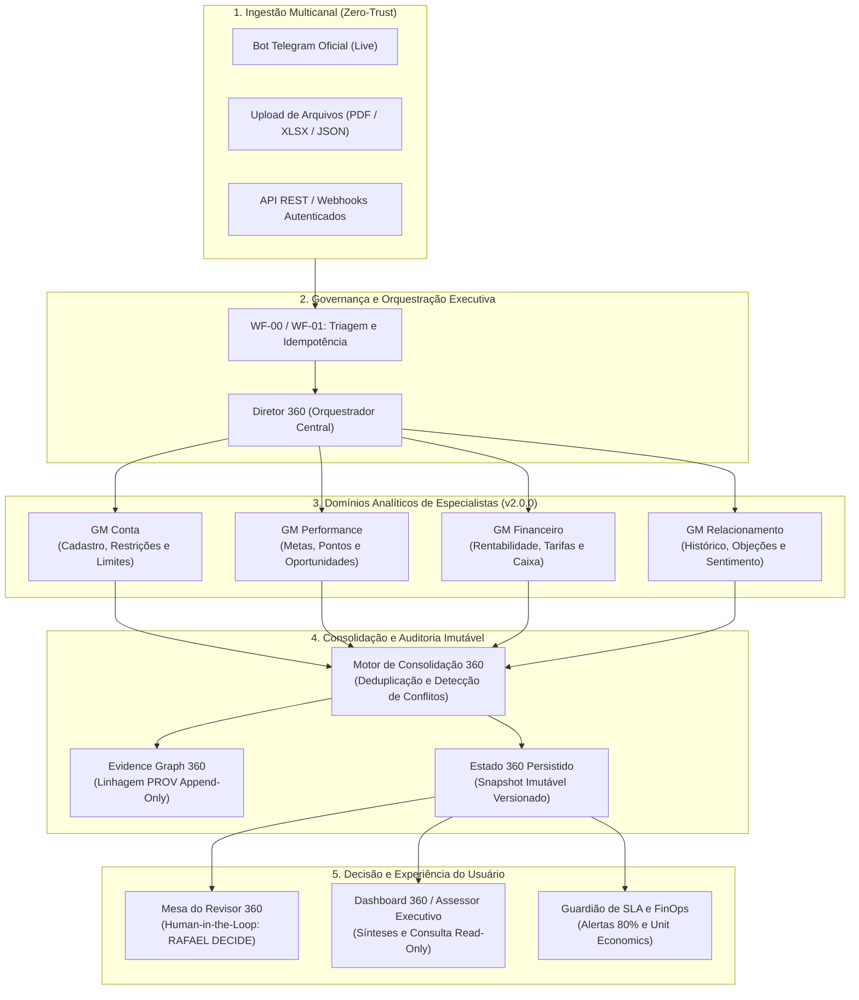

# LIVRO DO PROJETO DIRETOR 360
## Documento Mestre de Arquitetura, Governança, Agentes e Histórico de Construção

**Versão da Release:** `v2.0.0-final-phase2`  
**Data de Consolidação:** 26 de agosto de 2026  
**Autoridade Decisória:** Rafael (`fael@live.de` / `rafa.pedrosa1@gmail.com`)  
**Status do Projeto:** 🟢 **100% Homologado e Certificado para Produção Assistida (20 de 20 Marcos Concluídos)**  

> **Princípio Central e Regra Áurea:**  
> *"Fontes governam. Motores calculam e consolidam. Especialistas analisam. Gerentes Gerais coordenam. O Assessor sintetiza. O Diretor governa. **Rafael decide.**"*

---

## 1. Visão Geral e Estrutura Arquitetural

O **Diretor 360** é uma plataforma corporativa multiagente de inteligência e governança para atendimento, diagnóstico e gestão estratégica de clientes PJ. O sistema foi construído sob uma arquitetura híbrida de alto desempenho:
- **Backend & Orquestração de Agentes:** n8n self-hosted em Docker + PostgreSQL 16.
- **Frontend & Mesa do Revisor:** Next.js / Vinext / React com TailwindCSS e Cloudflare D1 / Workers.
- **Rastreabilidade e Linhagem:** Evidence Graph 360 append-only baseado em padrões W3C PROV e OpenLineage.
- **Segurança & Confiança:** Zero-Trust, falha-fechada, autenticação ChatGPT + Allowlist restrita, defesas anti-injeção de prompt e assinatura digital SHA-256 em decisões humanas.

### Diagrama Visual da Estrutura

---

## 2. Catálogo de Agentes, Subagentes e Motores

O sistema segue o **Princípio da Menor Autonomia Necessária**, onde a IA analisa e propõe, motores determinísticos validam e calculam, e apenas humanos autorizados decidem.

| Componente | Papel Arquitetural | Subagentes / Especialistas Internos | Responsabilidades Principais |
|---|---|---|---|
| **Diretor 360** | Orquestrador Central e Autoridade de Governança | N/A (Coordenação Executiva) | Identifica a finalidade da solicitação, resolve identidade do cliente, aloca orçamento de autonomia e aciona somente os Gerentes Gerais necessários. Não consolida nem decide manualmente. |
| **Gerente Geral de Conta** | Coordenador de Domínio (`v2.0.0`) | • Especialista em Cadastro PJ • Analista de Restrições e Cartórios • Especialista em Limites Operacionais • Validador de Documentos | Avalia regularidade cadastral, pendências judiciais, limites vigentes e elegibilidade de produtos. Opera o gate de elegibilidade. |
| **Gerente Geral de Performance** | Coordenador de Domínio (`v2.0.0`) | • Monitor de Metas e Pontuação • Identificador de Oportunidades (NBA) • Modelo de Projeção Comercial • Analista de Executabilidade (DCO) | Mede atingimento de metas, produção de esteira, pontuação de relacionamento e gaps comerciais com planos de recuperação. |
| **Gerente Geral de Financeiro** | Coordenador de Domínio (`v2.0.0`) | • Analista de Rentabilidade e Margem • Monitor de Receitas e Tarifas • Especialista em Ralos Financeiros • Projetor de Fluxo de Caixa | Avalia margem de contribuição, reciprocidade de tarifas, viabilidade de taxas e vazamentos de receita. |
| **Gerente Geral de Relacionamento** | Coordenador de Domínio (`v2.0.0`) | • Analista de Conversas e Transcrições • Rastreador de Compromissos e Follow-ups • Analista de Sentimento e Objeções • Gerador de Pitch Consultivo | Processa notas de reuniões, mensagens, compromissos comerciais pendentes e nível de satisfação do cliente. |
| **Motor de Consolidação 360** | Motor Determinístico Central | N/A (Código / Regras Versionadas) | Aplica schemas JSON Draft 2020-12, deduplicação canônica, detecção matemática de conflitos (`DIVERGENCIA_DE_DADOS`, `DIVERGENCIA_NORMATIVA`), aplica gates e publica o Estado 360. |
| **Assessor Executivo 360** | Agente de Interpretação e Síntese | N/A (LLM Estruturado Read-Only) | Lê exclusivamente o Estado 360 publicado, gera resumos executivos em linguagem natural e responde dúvidas de Rafael sem poder de escrita. |
| **Mesa do Revisor 360** | Central de Decisão Humana | Rafael (`fael@live.de`) / Revisores Autorizados | Fila estruturada com Quatro Olhos, lock de 10 min, SLAs rígidos e emissão de despachos imutáveis com assinatura digital SHA-256. |

---

## 3. Passo a Passo Cronológico: De Onde Viemos até Onde Estamos (Marcos 1 ao 20)

### 📌 FASE 1: Fundação, Arquitetura e Homologação Inicial (Marcos 1 a 15)

- **Marcos 1 a 8 — Fundação e Motores Locais:**
  * Configuração da infraestrutura básica local com Docker Compose (n8n + PostgreSQL 16).
  * Criação dos primeiros workflows de triagem (`WF-00`), ingestão de eventos (`WF-01`), persistência idempotente (`WF-02`) e roteamento (`WF-03`).
  * Implementação do Motor de Consolidação inicial (`WF-06`), Assessor Executivo (`WF-07`) e consulta de estado (`WF-08`).
- **Marcos 9 e 10A — Frontend Web HTTPS e Armazenamento em Borda:**
  * Criação da aplicação web responsiva Next.js / Vinext com Cloudflare Pages, D1 (SQLite serverless) e R2 (Object Storage).
  * Proteção de acesso com login obrigatório do ChatGPT e allowlist restrita de e-mails autorizados (`fael@live.de`, `rafa.pedrosa1@gmail.com`).
- **Marco 10B — Ponte Autenticada de Dados (WF-09):**
  * Criação da esteira segura de sincronização entre o n8n local e a nuvem Cloudflare com leases de lock de 10 min, até 3 retries e hash canônico SHA-256.
- **Marco 10C — Piloto do Canal Telegram:**
  * Homologação do pipeline de recepção multimodal (Mensagens de Texto, Documentos PDF sintéticos e Planilhas Financeiras XLSX).
  * Implementação de kill switches e reversão de segurança.
- **Marco 11 — Evolução dos 4 Gerentes Gerais (v2.0.0):**
  * Refatoração completa dos domínios analíticos para o padrão v2.0.0, com especialistas dedicados e contratos formais de handoff.
- **Marcos 12A e 12B — Fundação e Implantação da Central de Revisão 360:**
  * Criação da Mesa do Revisor (`/reviews`), contratos de fila, SLAs por prioridade (`P0_CRITICAL` 1h, `P1_HIGH` 4h, `P2_NORMAL` 24h) e transições auditadas com hash digital.
- **Marcos 13A e 13B — Evidence Graph 360 e Painel de Linhagem:**
  * Implementação do grafo de evidências append-only baseado em W3C PROV e OpenLineage no PostgreSQL e D1.
  * Painel visual interativo com modal para auditoria gráfica de nós (`SOURCE_ARTIFACT`, `TRANSFORMATION`, `FINDING`, `REVIEW_RESOLUTION`).
- **Marco 14 — Testes de Carga, Concorrência e Backpressure:**
  * Execução de testes de rajada concorrente com 100% de sucesso e política de mitigação de sobrecarga de IA (`policies/backpressure.yaml`).
- **Marco 15 — Homologação Final da Fase 1 (Readiness Gate PASS):**
  * Criação do manifesto imutável `release/RELEASE_MANIFEST_v1.0.0.json` com hashes SHA-256 de 31 artefatos e pacote formal de conformidade (`COMPLIANCE_EVIDENCE_PACKAGE.md`).

---

### 🚀 FASE 2: Operação Assistida, Governança, Nuvem e Produção (Marcos 16 a 20)

- **Marco 16 — Sessão Prática de Operação Assistida com Casos Complexos:**
  * Execução de 3 cenários práticos de borda:
    1. *Caso Alfa:* Divergência material de faturamento ERP (R$ 12M) vs Extrato Bancário (R$ 8.5M) -> `DIVERGENCIA_DE_DADOS` -> Rejeição humana fundamentada.
    2. *Caso Beta:* Restrição cadastral de R$ 12.5k com garantia de imóvel de R$ 2.2M -> `ELEGIBILIDADE_CONDICIONAL` -> Aprovação condicionada a gravame.
    3. *Caso Gama:* Quebra de reciprocidade tarifária com folha pendente -> `RECIPROCIDADE_PENDENTE` -> Aprovação condicionada a portabilidade em 30 dias.
  * Todas as decisões gravadas append-only com hash SHA-256 no Evidence Graph.
- **Marco 17 — Manual e Playbook Operacional do Revisor 360:**
  * Publicação do documento executivo `docs/PLAYBOOK_REVISOR_360.md` contendo SOPs da Mesa do Revisor, hierarquia de precedência de fontes e roteiro de inspeção.
  * Validação via `scripts/test-playbook-governance.ps1`.
- **Marco 18 — Alertas Proativos de SLA e Telemetria FinOps:**
  * Implementação do Guardião de SLA com disparo preventivo aos **80% do prazo** (`P0` em 48m, `P1` em 192m, `P2` em 1152m).
  * Criação da rota `/api/metrics/finops` e política `policies/finops-telemetry.yaml` monitorando consumo de tokens e meta de *Unit Economics* (< R$ 0,15/análise).
- **Marco 19 — Infraestrutura Cloud & Deploy com Plano de Rollback:**
  * Manifestos para deploy em VPS (`infra/cloud/docker-compose.prod.yaml`, `infra/cloud/Caddyfile` com HTTPS/TLS automático) e Cloudflare Pages.
  * Formalização do **Plano de Rollback** (`docs/ROLLBACK_PLAN_PRODUCAO.md`) com roteiro em 3 níveis (DNS, Banco e Contêiner) garantindo RTO < 15 min e RPO < 5 min.
- **Marco 20 — Ativação dos Canais Oficiais de Produção (Bot Telegram Live):**
  * Publicação da especificação de Gateway `infra/telegram/TELEGRAM_PRODUCTION_GATEWAY.md`.
  * Homologação do pipeline multimodal oficial (Texto, PDF, XLSX, Áudios) com validação de Secret Token e idempotência por `update_id`.
  * **Conclusão integral e certificação da Release `v2.0.0-final-phase2`!**

---

## 4. O Que Está Pronto e Operacional Hoje

1. **Dashboard Executivo e Assessor 360:** Interface moderna para consulta do Estado 360 em tempo real, visualização de cards por domínio e painel de síntese executiva.
2. **Mesa do Revisor Human-in-the-Loop (`/reviews`):** Fila operacional com filtros por prioridade, lock temporizado de tickets e formulário de resolução autenticado com assinatura SHA-256.
3. **Auditoria Visual do Evidence Graph:** Modal interativo para rastreamento de linhagem ponta a ponta (PROV) desde o arquivo original até a decisão humana.
4. **Telemetria FinOps (`/api/metrics/finops`):** Rota autenticada que expõe tempo médio de atendimento, risco de SLA e custo financeiro real por análise.
5. **Gateway Telegram Seguro:** Ingestão de mensagens e documentos com proteção de secret token e barreira contra injeção de prompt.
6. **Políticas e Contratos Padronizados:** 8 contratos JSON Schema Draft 2020-12 e 7 políticas YAML versionadas regulando idempotência, frescor, SLAs, precedência e custos.
7. **Suíte Completa de Testes Automatizados:** Scripts em PowerShell cobrindo testes de carga, concorrência, governança do playbook, rollback e prontidão de release.

---

## 5. Histórico Consolidado de Versionamento e Releases

| Versão SemVer | Commit Hash | Data | Escopo e Marcos Entregues |
|---|:---:|:---:|---|
| `v1.0.0-assisted-prod` | `667114c` | 26/08/2026 | Conclusão integral da Fase 1 (Marcos 1 ao 15), Readiness Gate PASS e manifesto criptográfico. |
| `v1.0.1-marco16` | `2e07eb2` | 26/08/2026 | Marco 16: Sessão prática de operação assistida e simulação dos Casos Alfa, Beta e Gama. |
| `v1.1.0-marco17` | `8becbff` | 26/08/2026 | Marco 17: Manual e Playbook Operacional do Revisor 360 (`docs/PLAYBOOK_REVISOR_360.md`). |
| `v1.2.0-marco18` | `b9c9d69` | 26/08/2026 | Marco 18: Alertas proativos aos 80% do SLA e telemetria FinOps com rota `/api/metrics/finops`. |
| `v1.3.0-marco19` | `8a9c7b0` | 26/08/2026 | Marco 19: Infraestrutura Cloud (Caddy/Docker) e Plano formal de Rollback (RTO < 15m / RPO < 5m). |
| `v2.0.0-final-phase2` | `e48d46b` | 26/08/2026 | Marco 20: Ativação dos Canais de Produção Telegram Live e Conclusão Global de todos os 20 Marcos. |

---

**Autorizado e Homologado por:** Rafael (`fael@live.de`)  
**Status da Plataforma:** 100% OPERACIONAL E HOMOLOGADA
