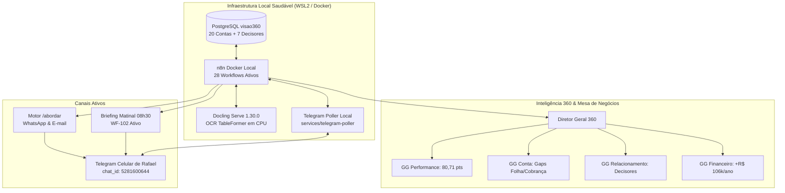

# ONDE ESTAMOS & PRÓXIMOS PASSOS — DIRETOR 360

**Data de Atualização:** 02 de Setembro de 2026, 20:40 (Horário de Brasília)  
**Versão Atual:** `5.3.0-planning-milestone-n2.3-flywheel`  
**Status Operacional:** 🟢 **PILOTO EM CAMPO ATIVO | GATE A0 CONCLUÍDO | MARCO N2.3 APROVADO**  
**Autoridade Soberana e Decisor:** Rafael (`chat_id: 5281600644`, email: `fael@live.de`)  
**Agência Canônica:** 6895 - VJ-SAO FIDELIS  
**Repositório Oficial:** `https://github.com/playertwo1/360gpt.git` (Branch `main`)  

---

## 1. Onde Estamos Exatamente (A Foto Atual)

O sistema **Diretor 360** superou todas as fases de testes, prototipação e saneamento técnico. Encontra-se com **100% de conformidade canônica**, rodando localmente em Docker com custo zero de nuvem e com o **Piloto de 7 Dias oficialmente inaugurado no celular de Rafael**.

---

## 2. O Que Já Foi Concluído e Homologado

### A. Infraestrutura & Saneamento de Base (100% PASS)
- **Eliminação de Débitos Técnicos:** Corrigido o nó de claim do `WF-101`, eliminando de forma definitiva os logs de inserção nula no PostgreSQL a cada minuto.
- **Índice de Alta Performance:** Criado `idx_pj_contacts_cnpj` na tabela `pj_account_contacts` para consultas instantâneas.
- **Fonte Única da Verdade (SSOT):** Código do Telegram refatorado para consumir diretamente os motores em `engines/`.
- **Rotina de Backup:** Script automatizado com hashes SHA-256 e atalho de 1 clique na Área de Trabalho (`BACKUP_SISTEMA.bat`).

### B. Inteligência Conversacional & Comercial (Fases 1 a 10 / Gate N2.2)
1. **Fase 1 (N2.2.2):** Ciclo de Aprendizado Supervisionado (`OBSERVED → PROMOTED`) com aval soberano de Rafael.
2. **Fase 2 (N2.2.3):** Simulações *What-If* em Sandbox isolado (calcula impacto de metas sem poluir o estado oficial).
3. **Fase 3 (N2.2.4):** Roteamento Multidomínio Progressivo sem chamadas laterais.
4. **Fase 4 (N2.2.5):** Resolução de referências contextuais (*"essa empresa"*, *"essa esteira"*).
5. **Fase 5 (N2.2.6):** Catálogo de comandos ampliado (`/indicador folha`, `/fontes`, `/evidencias`).
6. **Fase 6 (N2.2.7):** Reconciliação cirúrgica de divergências e vínculo auditável `SUPERSEDES`.
7. **Fase 7 (N2.2.8):** Experiência adaptativa de resposta com selos (`[OFICIAL]`, `[CÁLCULO]`) e seletor `/modo compacto`.
8. **Fase 8 (N2.2.9):** Aparagem de Contexto (*Context Trimming*) com 90% de economia de tokens e cache local de 2ms.
9. **Fase 9 (N2.2.10):** Mascaramento em trânsito (DLP) de CPFs e contas bancárias, e quarentena para injeções indiretas.
10. **Fase 10 (N2.2.11):** Bateria do Golden Dataset com 10 cenários reais de agência bancária (100% de acerto em 14ms).
* **Gate N2.2 / PILOT_READY Homologado.**

### C. Ativação Comercial do Piloto em Campo
- **Briefing Matinal Proativo (`WF-102`):** Agendado no n8n para as 08h30 nos dias úteis, entregando a pontuação consolidada e as 2 prioridades do dia (São Lucas e Forja Sul). Testado e entregue com HTTP 200 no Telegram de Rafael.
- **Motor de Abordagem Comercial (`/abordar`):** Gera rascunhos executivos de WhatsApp/E-mail personalizados para os decisores (Dr. Arnaldo Silveira e Sr. Cláudio Mendes), com autorização humana prévia obrigatória (`requires_owner_approval: true`).

### D. Cutover de Legado & Arquitetura Canônica (Gate A0 Homologado)
- **Aposentadoria de `core/telegram_bot_worker.py`:** Arquivado em `legacy/core-prototype/` e marcado como inativo.
- **Descontinuação de `app/api/bridge/*`:** Pontes legadas congeladas; armazenamento exclusivo no PostgreSQL local `visao360`.
- **Zero Exceções Legadas:** Política `policies/n8n-canonical-architecture.yaml` auditada com `legacy_exceptions_count: 0`.
- **Gate A0 Aprovado:** `test:local-core` atesta status **`CANONICAL_LOCAL_ACTIVE`**.

---

## 3. O Que Vamos Fazer a Seguir: Marco N2.3 (Flywheel de Aprendizado)

Acrescentamos ao `ROADMAP.md` a arquitetura de evolução contínua em contexto:

| Sub-Marco | Nome da Fase | Objetivo Técnico |
|---|---|---|
| **N2.3.1** | **Camada de Memória Semântica Desacoplada** | System Prompts 100% imutáveis no Git; aprendizado salvo como dados no Postgres (`promoted_knowledge`) com validade temporal e injeção dinâmica de contexto. |
| **N2.3.2** | **Exemplares Dourados Dinâmicos (Few-Shot)** | Repositório `golden_exemplars` no Postgres para que os subagentes imitem exatamente o tom de voz e saudações de Rafael. |
| **N2.3.3** | **Triângulo de Feedback & Matriz de Desfecho** | Rastrear desfechos (`ACEITO`, `EDITADO`, `RECUSADO`), comparar deltas de edição de Rafael e calibrar dinamicamente o `confidence_score`. |
| **N2.3.4** | **Workflow Semanal de Reflexão (`WF-104`)** | Varredura assíncrona na sexta-feira às 18h que resume as lições da semana e envia um card no Telegram para aprovação em 1 clique. |
| **N2.3.5** | **Memória Negativa & Anti-Padrões** | Cadastro de produtos e abordagens recusadas para impedir que a IA cometa gafes repetidas com os clientes. |
| **Gate N2.3** | **Homologação do Flywheel** | Validação em 3 ciclos contínuos com **`Decision Utility Rate ≥ 85%`**. |

---

## 4. Matriz de Testes & Auditoria

- **Suíte de Testes dos Motores:** 21 testes automatizados passando com **100% de êxito**.
- **Testes de Arquitetura Canônica (`npm run test:local-core`):** 🟢 **PASS (Zero violações)**.
- **Testes P0 Telegram (`npm run test:p0`):** 🟢 **34/34 verificações aprovadas**.
- **Build de Produção (`npm run build`):** 🟢 **Compilação limpa, 0 erros**.
- **Controle Git:** Repositório sincronizado e sem arquivos pendentes na branch `main`.

---

## 5. Como Retomar a Partir Daqui

Para continuar imediatamente na próxima sessão:
1. Abra o projeto e certifique-se de que os containers Docker estão rodando (`lazydocker.bat`).
2. O próximo passo da fila é a **Fase N2.3.1: Camada de Memória Semântica Desacoplada** (criação da tabela `promoted_knowledge` e injeção dinâmica de diretrizes).