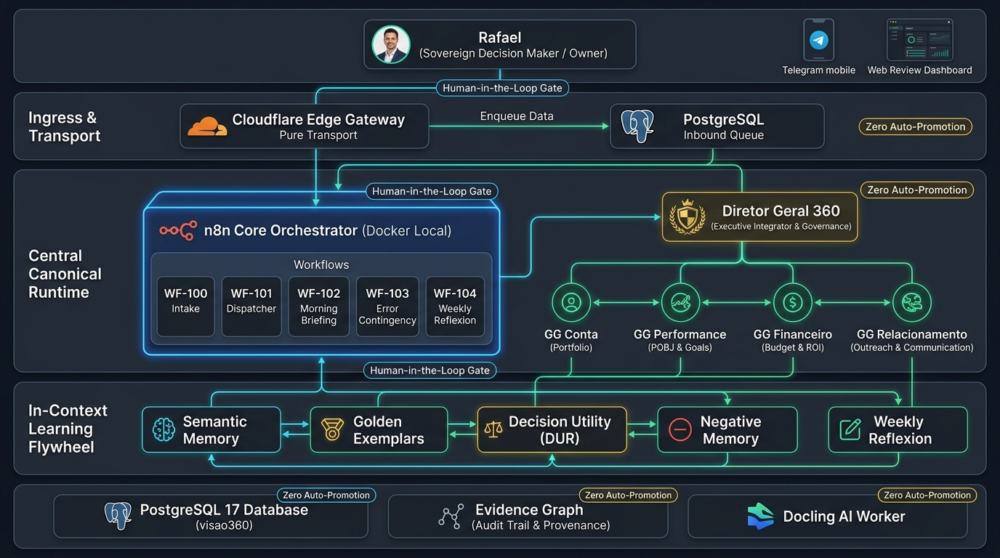

# Mapa Arquitetural Final — Sistema Diretor 360



---

## Visão Geral das Camadas

A arquitetura final do **Diretor 360** foi desenhada e homologada para garantir que **a IA apoie, investigue e sintetize, mas nunca tome decisões pelo proprietário**, operando com isolamento local, segurança corporativa e rastreabilidade total.

### 1. Camada Soberana (Decisão e Controle Humano)
- **Rafael (Owner & Decisor Soberano):** Autoridade máxima de negócio. Nenhum aprendizado, contratação, crédito, proposta a cliente ou alteração de política ocorre sem seu comando explícito.
- **Canais de Interação:**
  - **Telegram Mobile:** Interface ágil do dia a dia no celular (recebimento do Briefing Matinal, envio de PDFs/comprovantes, aprovação em 1 toque de diretrizes via `/aprovardiretriz` e rascunhos de mensagens comerciais).
  - **Web Review Dashboard:** Painel gerencial para conferência analítica, laudos detalhados, triagem de pendências e auditoria de estado.

---

### 2. Camada Perimetral de Transporte & Ingestão
- **Cloudflare Edge Gateway (`/api/ingest/telegram`):**
  - **Papel:** Transporte técnico puro (Edge).
  - **Responsabilidades:** Validação criptográfica do token de webhook em tempo constante, filtragem de bots (`is_bot`), controle de tamanho e rate-limit.
  - **Regra de Ouro:** **Zero regras de negócio no Edge**. Toda mensagem ou documento é enfileirado atomicamente no PostgreSQL local (`telegram_inbound_events`), retornando HTTP 202/200 imediato.

---

### 3. Núcleo Canônico de Execução (n8n Docker Local)
- **Instância n8n Privada (`127.0.0.1:5678`):** Autoridade operacional exclusiva. Todo fluxo, agendamento, tratamento de erro e entrega transacional residem aqui.
- **Workflows Canônicos Homologados:**
  - `WF-100 — Ingestion & Intake:` Recepção técnica e triagem de envelopes de mensagens e anexos.
  - `WF-101 — Dispatcher Local:` Orquestrador transacional de fila (`FOR UPDATE SKIP LOCKED`) garantindo concorrência segura, processamento atômico e leases com timeout.
  - `WF-102 — Morning Briefing & Delivery:` Disparo diário proativo às 08h30 com metas do POBJ e prioridades comerciais do dia; entrega Telegram idempotente com limite seguro de caracteres.
  - `WF-103 — Contingência & Auditoria:` Tratamento centralizado de exceções, gravação de eventos sanitizados em `audit_log` e failover controlado.
  - `WF-104 — Reflexion Engine Semanal:` Execução às sextas-feiras às 18h00 para cálculo de DUR em dados persistidos e apresentação de lições candidatas.

---

### 4. Mesa Executiva Multiagente (Mesa dos 4 Gerentes Gerais)
- **Diretor Geral 360:** Parceiro executivo de Rafael. Desafia premissas, integra domínios, governa dependências e subordina as ações aos objetivos estratégicos.
- **Os 4 Gerentes Gerais:**
  1. **GG Conta:** Guardião e desenvolvedor da carteira. Cuida da elegibilidade, blindagem de clientes, abertura de contas e oxigenação da base.
  2. **GG Performance:** Converte metas do POBJ e pesos em prioridades executáveis (pontos, esforço, prazo e reconhecimento).
  3. **GG Financeiro:** Explica margens, ROE, FinOps, orçamento realizado e impacto financeiro das operações.
  4. **GG Relacionamento:** Compreende dores dos decisores, histórico de conversas, quebra de objeções e gera abordagens de alto impacto (WhatsApp/E-mail).

---

### 5. Flywheel de Aprendizado Contínuo em Contexto (Marco N2.3)
Garante evolução contínua da IA **sem re-treinar pesos e sem alterar prompts imutáveis no Git**:
- **Memória Semântica (`promoted_knowledge`):** Regras aprendidas com Rafael nascem obrigatoriamente como `CANDIDATE`. Somente após autorização de Rafael viram `PROMOTED` e passam a ser injetadas de forma subordinada no *Context Packet*.
- **Exemplares Dourados Dinâmicos (`golden_exemplars`):** Repositório de abordagens reais com avaliação 5/5 de Rafael (Few-Shot dinâmico). Busca sem correspondência retorna `null` para evitar contaminação.
- **Matriz de Desfecho & DUR (`decision_outcomes`):** Mede a aceitação do usuário (`Decision Utility Rate`). Se a amostra for inferior a 5, o sistema declara `NOT_ENOUGH_DATA` e não inventa padrões.
- **Memória Negativa & Anti-Padrões (`negative_memory`):** Intercepta e barra previamente argumentos, produtos ou canais vetados por Rafael ou recusados pelos clientes.
- **Reflexion Semanal:** Detecção estatística de recorrência ($\ge 2$ ocorrências) que alimenta a síntese do WF-104.

---

### 6. Camada de Persistência, Linhagem e Documentos
- **PostgreSQL 17 Local (`visao360`):** Schemas estritos com chaves UUID, validação de janelas de vigência (`valid_from < valid_to`), enums e `idempotency_key UNIQUE`.
- **Evidence Graph 360:** Grafo append-only imutável de nós e arestas ligando cada achado, recomendação e decisão à sua evidência de origem autorizada (W3C PROV / OpenLineage).
- **Docling AI Worker (CPU):** Extração técnica de texto, layouts complexos e tabelas de PDFs, imagens e demonstrativos financeiros sem interferência humana.

---

## As 4 Leis Inegociáveis da Governança 360

```
1. Fontes governam.
2. Motores calculam.
3. Especialistas investigam e Gerentes Gerais interpretam.
4. O Diretor integra e desafia. Rafael decide.
```
